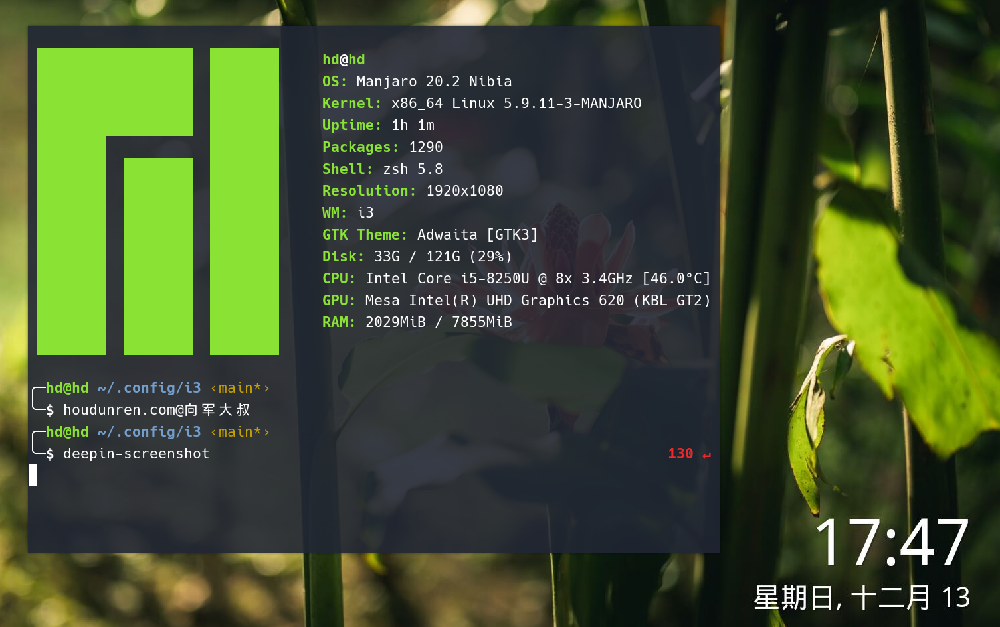

## 安装配置

[houdunren.com](https://www.houdunren.com) @ 向军大叔

[toc]

[I3](https://i3wm.org/docs/userguide.html#_default_keybindings) 是多容器管理器



### 安装i3

下面是常用LINUX发行版本安装

**ubuntu**

```
sudo apt install i3
```

**Manjaro**

```
sudo pacman -S i3
```

### 配置文件

 `~/.config/i3/config` 为i3的配置文件

## 大叔配置

向军老师已经将使用的[I3配置](https://github.com/houdunwang/i3)开源了，大家可以[CLONE](https://github.com/houdunwang/i3)下来直接使用，省时少力。

### 安装 

```
git clone https://github.com/houdunwang/i3.git ~/.config/i3
```


## 快捷键

向军大叔将窗口的移动切换改成了vim布局，下面有部分快捷键就是改后的快捷键，最后我也放出的我使用的完整配置文件。

### 基础控制

| 快捷键           | 说明                            |
| :--------------- | :------------------------------ |
| $mod + Shift + q | 结束当前窗口的进程              |
| $mod + Shift + E | 退出 i3                         |
| $mod + Shift + C | 当场重新加载 i3config, 无需重启 |
| $mod + Shift + R | 根据新配置重启 i3               |
| $mod + D         | 启动 dmenu                      |

### 布局控制

| 快捷键                  | 说明                     |
| :---------------------- | :----------------------- |
| $mod + Enter            | 启动虚拟终端             |
| $mod + A                | 焦点转义到父窗口上       |
| $mod + S                | 堆叠布局                 |
| $mod + W                | 标签布局                 |
| $mod + E                | 默认布局                 |
| $mod + Shift + SpaceBar | 窗口在平铺式／浮动式转换 |

### 工作区

使用**工作空间**是分组归类一堆窗口的好方法

| 快捷键      | 说明                |
| ----------- | ------------------- |
| $mod+数字键 | 切换到其他workspace |

### 窗口管理

| 快捷键                   | 说明                                 |
| :----------------------- | :----------------------------------- |
| $mod + n                 | 水平分割窗口                         |
| $mod + V                 | 垂直分割窗口                         |
| $mod+q                   | 直分割窗口                           |
| $mod + Shift + h         | 窗口左移                             |
| $mod + Shift + j         | 窗口下移                             |
| $mod + Shift + k         | 窗口上移                             |
| $mod + Shift + l         | 窗口右移                             |
| $mod+ Shift + 工作区数字 | 移动窗口到工作区                     |
| $mod + r                 | 调整窗口大小                         |
| $mod +a                  | 聚焦到父容器，用于相对父容器切换窗口 |

### 浮动窗口

浮动窗口一直处于平铺窗口的上方

| 快捷键             | 说明               |
| ------------------ | ------------------ |
| $mod + Shift+space | 切换窗口的浮动模式 |
| $mod + 鼠标        | 移动窗口           |

### 焦点控制

| 快捷键   | 说明           |
| :------- | :------------- |
| $mod + h | 焦点往左窗口移 |
| $mod + j | 焦点往下窗口移 |
| $mod + k | 焦点往上窗口移 |
| $mod + l | 焦点往右窗口移 |

### 基础控制

| 快捷键           | 说明                            |
| :--------------- | :------------------------------ |
| $mod + Shift + q | 结束当前窗口的进程              |
| $mod + Shift + E | 退出 i3                         |
| $mod + Shift + C | 当场重新加载 i3config, 无需重启 |
| $mod + Shift + R | 根据新配置重启 i3               |
| $mod + D         | 启动 dmenu                      |


## 常用软件

下面是用到的一些软件 

### 系统信息

```
yay -Sy screenfetch
```

### 壁纸设置

`variety` 可以定时更换壁纸

```text
yay -Sy variety 
```

### 软件搜索	

使用 $mod+d 快速搜索软件

```
sudo pacman -S dmenu
```

### 快速搜索

请自定义快捷键

```
sudo pacman -Sy albert
```

### 文件管理器

下面两款软件都是文件管理器，以任何一个就可以了

```
sudo pacman -S thunar
```

### 网络连接

下面来介绍如何连接WIFI，首先安装需要的插件

```
sudo pacman -S extra/network-manager-applet

sudo pacman -S extra/nm-connection-editor
```

现在可 以在下面的状态栏中选择WIFI了

### 显示器连接

有时需要外接显示器这时需要安装软件来控制 

```
sudo pacman -S arandr
```

### 蓝牙设备

连接蓝牙设备需要安装软件

```
sudo pacman -S blueman
```

### 声音管理

需要安装以下插件控制

```
sudo pacman -S volumeicon
```

### 窗口透明度

插件会将除当前软件以外的软件进行透明显示，首先安装插件

```
sudo pacman -S picom 
```

### 电源管理

安装以下插件用于控制电脑管理

```
sudo pacman -S mate-power-manager
```

### 默认编辑器

在 `~/.zshrc`  蚛配置文中件添加以下指令。下例是将默认编辑器修改为nvim

```
export EDITOR=nvim
```

## 键盘映射

通过修改配置文件 `~/.xmodmap`可以定义键盘映射

下面是将 Control 与 CapLock互换

```
remove Lock = Caps_Lock
remove Control = Control_L
keysym Control_L = Caps_Lock
keysym Caps_Lock = Control_L
add Lock = Caps_Lock
add Control = Control_L
```

下面是将左侧alt键与ctl键互换

```
clear control
clear mod1
keycode 37 = Alt_L Meta_L
keycode 64 = Control_L
add control = Control_L Control_R
add mod1 = Alt_L Meta_L
```

执行 `xmodmap ~/.xmodmap` 命令重新加载配置，现在已经有效果了

不要将指令添加到`.zshrc` 文件中，这会造成新的终端映射失效

